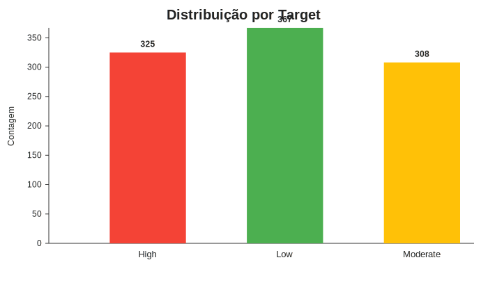

# Análise estatística da qualidade do ar (CO e NOx)

## 1) Medidas de tendência central e variação

### CO (CO(GT))
- Amostras válidas: **676** (valores `-200` tratados como ausentes).
- Média: **0.7234**
- Mediana: **0.5000**
- Moda: **0.5** (frequência: 374)
- Variância amostral: **0.0619**
- Desvio padrão: **0.2488**
- Intervalo observado: **0.5 a 1.0**

### NOx (NOx(GT))
- Amostras válidas: **656** (valores `-200` tratados como ausentes).
- Média: **125.4573**
- Mediana: **150.0000**
- Moda: **150.0** (frequência: 334)
- Variância amostral: **625.7447**
- Desvio padrão: **25.0149**
- Intervalo observado: **100.0 a 150.0**

## 2) Quantidade por grupo no Target

- **Low**: 367 registros (36.7%).
- **High**: 325 registros (32.5%).
- **Moderate**: 308 registros (30.8%).

## 3) Leitura estatística

- A mediana de **CO** é 0.5, próxima da moda (0.5), indicando concentração no menor patamar observado.
- Para **NOx**, mediana e moda em 150 sugerem concentração no patamar superior disponível, apesar da média ficar menor (125.46) pela presença de valores em 100.
- A variabilidade relativa do NOx é maior em termos absolutos (desvio padrão ≈ 25) do que a do CO (≈ 0.249), mostrando maior oscilação entre os dois níveis observados de NOx.

### Médias por grupo de risco (Target)

| Target | n válido CO | n válido NOx | Média CO | Média NOx |
|---|---:|---:|---:|---:|
| Low | 239 | 254 | 0.709 | 127.362 |
| Moderate | 215 | 212 | 0.740 | 125.943 |
| High | 222 | 190 | 0.723 | 122.368 |

Interpretação rápida:
- O grupo **Moderate** tem a maior média de CO.
- O grupo **Low** tem a maior média de NOx nesta amostra.
- As diferenças são pequenas, o que indica que outras variáveis ambientais também podem influenciar o Target.

## 4) Storytelling (contexto em linguagem natural)

Imagine uma cidade em que, ao amanhecer, o tráfego começa a crescer e os corredores urbanos passam a concentrar emissões. Mesmo com parte das medições em níveis baixos de CO, o NOx frequentemente aparece em patamares altos. Isso sinaliza um ambiente onde o ar pode parecer "normal" para quem observa apenas um indicador, mas continua agressivo para vias respiratórias sensíveis.

Com o passar dos dias, a população mais vulnerável — crianças, idosos e pessoas com asma — sente primeiro: tosse persistente, irritação e piora de crises respiratórias. Os serviços de saúde percebem aumento de atendimentos em períodos de maior acúmulo de poluentes. O retrato estatístico do dataset reforça esse enredo: a presença recorrente de níveis elevados de NOx é um alerta para políticas públicas preventivas.

## 5) Ações recomendadas para autoridades sanitárias

1. **Sistema de alerta por qualidade do ar** em tempo real (apps, SMS e rádio), com recomendações específicas para grupos de risco.
2. **Protocolos sazonais de saúde respiratória** (reforço de equipes, insumos e triagem) em dias com pior dispersão atmosférica.
3. **Integração com mobilidade urbana**: restrição de emissões em horários críticos, incentivo a transporte limpo e zonas de baixa emissão.
4. **Vigilância epidemiológica ambiental**: correlacionar poluentes com internações por bairro para ações direcionadas.
5. **Intervenções em escolas e unidades de saúde**: monitoramento de ar interno, filtragem adequada e orientação à comunidade.
6. **Campanhas de prevenção**: reduzir exposição em horários de pico, uso correto de medicação de controle em asmáticos e ampliação de vacinação respiratória.

---
Relatório gerado automaticamente por `analise_qualidade_ar.py`.
